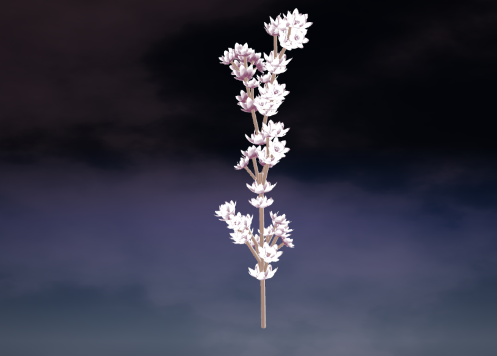

# L-System Plant
By Annie Su, anniesu1

## Project screenshots
2 Expansions

3 Expansions

4 Expansions

## Inspiration
Flower sprigs

## Implementation details and features
- L-System structure: I created a collection of classes to represent an L-System. The `LSystem` is the overarching class that holds together a set of `ExpansionRule`s, `DrawingRule`s, and a `Turtle` to track the current state of the drawing (with attributes such as orientation and position). 
\n
- The `ExpansionRule` class holds a map of (key, value) pairs that contain (probability, successor). In other words, each successor has an associated probability, and when we expand the predecessor, we are returned a random successor from the set of possible ones. This allows for organic variation in the plant. I leveraged this to allow for randomization in which plane (x, y, z) for the plant to grow.

- When we rotate the Turtle, I add in noise to the rotation angle. The noise falls in the range of [-5, 5] degrees.

2D view of rotation angles without noise:

2D view of rotation angles with noise:

- Drawing: This plant is built from repeated cylinder and flower shapes. There is one cylinder mesh and one flower mesh, but each mesh is drawn multiple times with different transformations, which are created in the `LSystem` class and passed back to the `Main` class. The cylinder (or branch) mesh is scaled by the `Turtle`'s attribute: depth. I use a height and general size falloff which scales down the size of the branch such that it gets smaller with greater depth. 
- Instanced Rendering: Instanced rendering allows for us to use only one instance of the mesh in the first place. After `LSystem` returns the transformation matrices to `Main`, I pass each column of the transformation matrix into the vertex shader, where I can then transform the mesh and output to console. The transformation matrix accounts for translation, rotation, and  scaling. 
- Interactivity: On the console, the user may alter the axiom, the number of iterations to expand the grammar by, and the rotation angle used in branching. 
- Background and shaders: I applied lambertian shading to the geometry by hard-coding a light position and applying the lambertian term to the color. The background night sky is made by mapping the y-coordinate to a gradient of blues. The clouds are made using perlin-based fractal brownian motion.

## Resources
- CIS 700 L-Systems (helpful in establishing structure of the Rule class) [Slide deck](https://cis700-procedural-graphics.github.io/files/lsystems_1_31_17.pdf)
- 3D grammar expansions and applications [Textbook](http://algorithmicbotany.org/papers/abop/abop-ch1.pdf)
- Mostly conceptual explanations [Textbook](http://pcgbook.com/wp-content/uploads/chapter05.pdf)
- Typescript functions [Documentation](https://www.typescriptlang.org/docs/handbook/functions.html)
- CIS 460 transformation matrices [Slide deck](http://www.cis.upenn.edu/~cis277/16sp/lectures/460transforms3d.html#slide-26)
